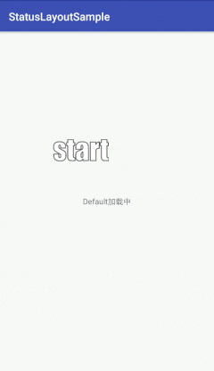

# [StatusLayout](https://github.com/ronghao/StatusLayout)  [](https://jitpack.io/#ronghao/StatusLayout) [](https://raw.githubusercontent.com/ronghao/StatusLayout/master/LICENSE)

> 管理多种状态（网络加载中、网络错误状态、网络正确状态）的viewgroup


# 示例



# 层次结构
### 普通布局
- 根节点
	- 加载中
	- 加载失败
	- 加载成功后应该显示的子布局

### 带进度条的布局【参见 [DefaultStatusProgressLayout](https://github.com/ronghao/StatusLayout/blob/master/app/src/main/java/com/haohaohu/statuslayoutsample/imp/DefaultStatusProgressLayout.java)】
- 根节点
	- 加载中
	- 加载失败
	- 加载成功后应该显示的子布局
	- 覆盖子布局的半透明布局，防止在网络请求过程中误操作


# 项目添加方法
在根 build.gradle中添加
```
allprojects {
    repositories {
        ...
        maven { url 'https://jitpack.io' }
    }
}
```

在项目build.gradle中添加 
```
dependencies {
    compile 'com.github.ronghao:StatusLayout:1.0.0'
}
```


# 版本
- 1.0.1
	- [demo中]添加子布局覆盖半透明布局
- 1.0.0
	- 实现多状态管理（网络加载中、网络错误状态、网络正确状态）
	- 状态变化的回调监听
	- 网络错误状态，点击错误界面重新请求（和上面的回调接口组合到一起）


# 关于
+ 个人博客：[www.haohaohu.com](http://www.haohaohu.com/)
+ 如果你也喜欢这个库，Star一下吧，欢迎Fork

# License

    Copyright 2016 haohaohu

    Licensed under the Apache License, Version 2.0 (the "License");
    you may not use this file except in compliance with the License.
    You may obtain a copy of the License at

       http://www.apache.org/licenses/LICENSE-2.0

    Unless required by applicable law or agreed to in writing, software
    distributed under the License is distributed on an "AS IS" BASIS,
    WITHOUT WARRANTIES OR CONDITIONS OF ANY KIND, either express or implied.
    See the License for the specific language governing permissions and
    limitations under the License.